# Regenerated Mermaid Diagrams - Updated with Correct Naming Conventions

This document contains all regenerated Mermaid diagram code with updated class names (AIEngine, LLMClient, JWTUtil, UUID) consistent with the 2026-02-15 naming convention alignment.

**How to regenerate PNG files:**
1. Use [Mermaid Live Editor](https://mermaid.live/) - paste code and export as PNG
2. Use mermaid-cli: `npm install -g @mermaid-js/mermaid-cli` then `mmdc -i diagram.mmd -o diagram.png`
3. Use VS Code with Mermaid extension
4. Use online converters that support Mermaid

---

## Dev Spec 1: AI-Powered Workflow Management - Board Generation

### dev_spec1_diagram_1.mmd - Architecture Diagram (WF1-WF4 System)

System architecture showing the flow from Project Input through AI Analysis to Board Generation and Board Management.

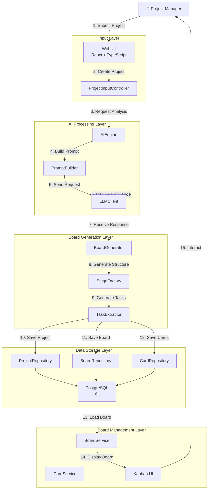
```mermaid
graph TB
    User["👤 Project Manager"]
    
    subgraph Input["Input Layer"]
        UI["Web UI<br/>React + TypeScript"]
        Controller["ProjectInputController"]
    end
    
    subgraph AI["AI Processing Layer"]
        AIEngine["AIEngine"]
        PromptBuilder["PromptBuilder"]
        LLMClient["LLMClient"]
    end
    
    subgraph Generation["Board Generation Layer"]
        BoardGenerator["BoardGenerator"]
        StageFactory["StageFactory"]
        TaskExtractor["TaskExtractor"]
    end
    
    subgraph Storage["Data Storage Layer"]
        ProjectRepo["ProjectRepository"]
        BoardRepo["BoardRepository"]
        CardRepo["CardRepository"]
        Database["PostgreSQL<br/>16.1"]
    end
    
    subgraph Management["Board Management Layer"]
        BoardService["BoardService"]
        CardService["CardService"]
        UserInterface["Kanban UI"]
    end
    
    User -->|"1. Submit Project"| UI
    UI -->|"2. Create Project"| Controller
    Controller -->|"3. Request Analysis"| AIEngine
    
    AIEngine -->|"4. Build Prompt"| PromptBuilder
    PromptBuilder -->|"5. Send Request"| LLMClient
    LLMClient -->|"6. Call GPT-4/Claude"| AI
    LLMClient -->|"7. Receive Response"| BoardGenerator
    
    BoardGenerator -->|"8. Generate Structure"| StageFactory
    StageFactory -->|"9. Generate Tasks"| TaskExtractor
    
    TaskExtractor -->|"10. Save Project"| ProjectRepo
    ProjectRepo --> Database
    TaskExtractor -->|"11. Save Board"| BoardRepo
    BoardRepo --> Database
    TaskExtractor -->|"12. Save Cards"| CardRepo
    CardRepo --> Database
    
    Database -->|"13. Load Board"| BoardService
    BoardService -->|"14. Display Board"| UserInterface
    UserInterface -->|"15. Interact"| User
```

### dev_spec1_diagram_2.mmd - Class Diagram (WF1-WF4)

Complete class diagram showing all controllers, services, repositories, and domain models with proper relationships and updated naming.

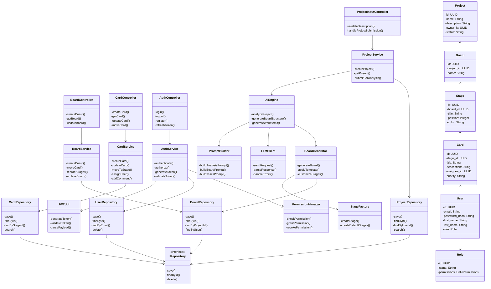
```mermaid
classDiagram
    %% Interfaces
    class IRepository {
        <<interface>>
        save()
        findById()
        delete()
    }

    %% Controllers (WF1.1, WF2.2, WF3.1)
    class ProjectInputController {
        -validateDescription()
        -handleProjectSubmission()
    }
    
    class BoardController {
        -createBoard()
        -getBoard()
        -updateBoard()
    }
    
    class CardController {
        -createCard()
        -getCard()
        -updateCard()
        -moveCard()
    }
    
    class AuthController {
        -login()
        -logout()
        -register()
        -refreshToken()
    }

    %% Services - WF1 (AI Board Generation)
    class ProjectService {
        -createProject()
        -getProject()
        -submitForAnalysis()
    }
    
    class AIEngine {
        -analyzeProject()
        -generateBoardStructure()
        -generateWorkItems()
    }
    
    class PromptBuilder {
        -buildAnalysisPrompt()
        -buildBoardPrompt()
        -buildTasksPrompt()
    }
    
    class LLMClient {
        -sendRequest()
        -parseResponse()
        -handleErrors()
    }
    
    class BoardGenerator {
        -generateBoard()
        -applyTemplate()
        -customizeStages()
    }
    
    class StageFactory {
        -createStage()
        -createDefaultStages()
    }

    %% Services - WF2 (Board Management)
    class BoardService {
        -createBoard()
        -moveCard()
        -reorderStages()
        -archiveBoard()
    }
    
    class CardService {
        -createCard()
        -updateCard()
        -moveToStage()
        -assignUser()
        -addComment()
    }

    %% Services - WF3 (Auth & Security)
    class AuthService {
        -authenticate()
        -authorize()
        -generateToken()
        -validateToken()
    }
    
    class PermissionManager {
        -checkPermission()
        -grantPermission()
        -revokePermission()
    }
    
    class JWTUtil {
        -generateToken()
        -validateToken()
        -parsePayload()
    }

    %% Repositories
    class UserRepository {
        -save()
        -findById()
        -findByEmail()
        -delete()
    }
    
    class ProjectRepository {
        -save()
        -findById()
        -findByUserId()
        -search()
    }
    
    class BoardRepository {
        -save()
        -findById()
        -findByProjectId()
        -findByUser()
    }
    
    class CardRepository {
        -save()
        -findById()
        -findByStageId()
        -search()
    }

    %% Domain Models (WF4)
    class User {
        -id: UUID
        -email: String
        -password_hash: String
        -first_name: String
        -last_name: String
        -role: Role
    }
    
    class Project {
        -id: UUID
        -name: String
        -description: String
        -owner_id: UUID
        -status: String
    }
    
    class Board {
        -id: UUID
        -project_id: UUID
        -name: String
    }
    
    class Stage {
        -id: UUID
        -board_id: UUID
        -title: String
        -position: Integer
        -color: String
    }
    
    class Card {
        -id: UUID
        -stage_id: UUID
        -title: String
        -description: String
        -assignee_id: UUID
        -priority: String
    }
    
    class Role {
        -id: UUID
        -name: String
        -permissions: List~Permission~
    }

    %% Relationships
    ProjectInputController --> ProjectService
    ProjectService --> AIEngine
    ProjectService --> ProjectRepository
    
    AIEngine --> PromptBuilder
    AIEngine --> LLMClient
    AIEngine --> BoardGenerator
    
    BoardGenerator --> StageFactory
    BoardGenerator --> BoardRepository
    
    BoardController --> BoardService
    BoardService --> BoardRepository
    
    CardController --> CardService
    CardService --> CardRepository
    
    AuthController --> AuthService
    AuthService --> JWTUtil
    AuthService --> UserRepository
    
    AuthService --> PermissionManager
    
    ProjectRepository --> IRepository
    UserRepository --> IRepository
    BoardRepository --> IRepository
    CardRepository --> IRepository

    User --> Role
    Project <-- Board
    Board <-- Stage
    Stage <-- Card
    Card <-- User
```

### dev_spec1_diagram_4.mmd - Card Entity State Diagram

Shows the lifecycle states of a Card entity as it moves through the kanban board.

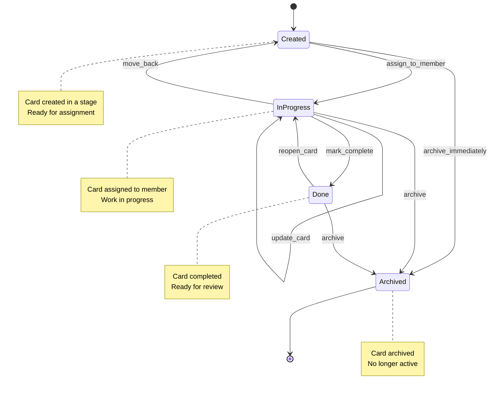
```mermaid
stateDiagram-v2
    [*] --> Created
    
    Created --> InProgress: assign_to_member
    Created --> Archived: archive_immediately
    
    InProgress --> Done: mark_complete
    InProgress --> Created: move_back
    InProgress --> InProgress: update_card
    InProgress --> Archived: archive
    
    Done --> InProgress: reopen_card
    Done --> Archived: archive
    
    Archived --> [*]
    
    note right of Created
        Card created in a stage
        Ready for assignment
    end note
    
    note right of InProgress
        Card assigned to member
        Work in progress
    end note
    
    note right of Done
        Card completed
        Ready for review
    end note
    
    note right of Archived
        Card archived
        No longer active
    end note
```

### dev_spec1_diagram_5.mmd - Project Creation Flow (Sequence Diagram)

Detailed sequence showing the complete flow from project submission through AI analysis to board generation with all service interactions.

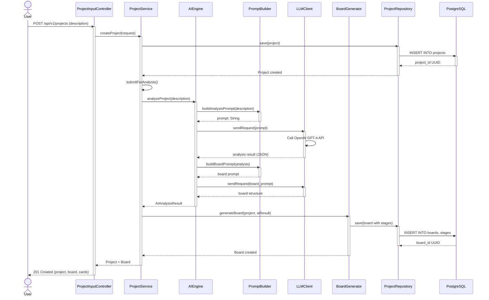
```mermaid
sequenceDiagram
    actor User
    participant Controller as ProjectInputController
    participant Service as ProjectService
    participant AIEngine
    participant PromptBuilder
    participant LLM as LLMClient
    participant BoardGen as BoardGenerator
    participant Repo as ProjectRepository
    participant DB as PostgreSQL

    User->>Controller: POST /api/v1/projects (description)
    activate Controller
    
    Controller->>Service: createProject(request)
    activate Service
    
    Service->>Repo: save(project)
    activate Repo
    Repo->>DB: INSERT INTO projects
    activate DB
    DB-->>Repo: project_id UUID
    deactivate DB
    Repo-->>Service: Project created
    deactivate Repo
    
    Service->>Service: submitForAnalysis()
    
    Service->>AIEngine: analyzeProject(description)
    activate AIEngine
    
    AIEngine->>PromptBuilder: buildAnalysisPrompt(description)
    activate PromptBuilder
    PromptBuilder-->>AIEngine: prompt: String
    deactivate PromptBuilder
    
    AIEngine->>LLM: sendRequest(prompt)
    activate LLM
    LLM->>LLM: Call OpenAI GPT-4 API
    LLM-->>AIEngine: analysis result (JSON)
    deactivate LLM
    
    AIEngine->>PromptBuilder: buildBoardPrompt(analysis)
    activate PromptBuilder
    PromptBuilder-->>AIEngine: board prompt
    deactivate PromptBuilder
    
    AIEngine->>LLM: sendRequest(board_prompt)
    activate LLM
    LLM-->>AIEngine: board structure
    deactivate LLM
    
    AIEngine-->>Service: AIAnalysisResult
    deactivate AIEngine
    
    Service->>BoardGen: generateBoard(project, aiResult)
    activate BoardGen
    BoardGen->>Repo: save(board with stages)
    activate Repo
    Repo->>DB: INSERT INTO boards, stages
    DB-->>Repo: board_id UUID
    deactivate Repo
    BoardGen-->>Service: Board created
    deactivate BoardGen
    
    Service-->>Controller: Project + Board
    deactivate Service
    
    Controller-->>User: 201 Created (project, board, cards)
    deactivate Controller
```

### dev_spec1_diagram_6.mmd - Card Management Flow (Sequence Diagram)

Card lifecycle including creation, updates, and movement across stages.

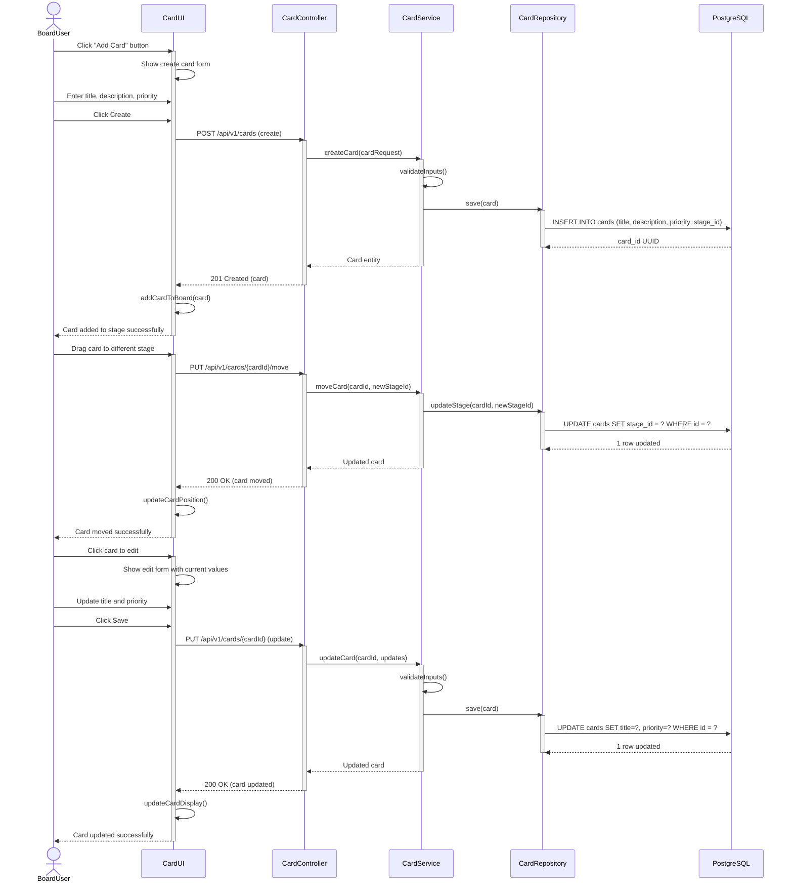
```mermaid
sequenceDiagram
    actor User as BoardUser
    participant View as CardUI
    participant Controller as CardController
    participant Service as CardService
    participant Repo as CardRepository
    participant DB as PostgreSQL

    User->>View: Click "Add Card" button
    activate View
    
    View->>View: Show create card form
    User->>View: Enter title, description, priority
    User->>View: Click Create
    
    View->>Controller: POST /api/v1/cards (create)
    activate Controller
    
    Controller->>Service: createCard(cardRequest)
    activate Service
    
    Service->>Service: validateInputs()
    Service->>Repo: save(card)
    activate Repo
    
    Repo->>DB: INSERT INTO cards (title, description, priority, stage_id)
    DB-->>Repo: card_id UUID
    deactivate Repo
    
    Service-->>Controller: Card entity
    deactivate Service
    
    Controller-->>View: 201 Created (card)
    deactivate Controller
    
    View->>View: addCardToBoard(card)
    View-->>User: Card added to stage successfully
    deactivate View
    
    User->>View: Drag card to different stage
    activate View
    
    View->>Controller: PUT /api/v1/cards/{cardId}/move
    activate Controller
    
    Controller->>Service: moveCard(cardId, newStageId)
    activate Service
    
    Service->>Repo: updateStage(cardId, newStageId)
    activate Repo
    
    Repo->>DB: UPDATE cards SET stage_id = ? WHERE id = ?
    DB-->>Repo: 1 row updated
    deactivate Repo
    
    Service-->>Controller: Updated card
    deactivate Service
    
    Controller-->>View: 200 OK (card moved)
    deactivate Controller
    
    View->>View: updateCardPosition()
    View-->>User: Card moved successfully
    deactivate View
    
    User->>View: Click card to edit
    activate View
    
    View->>View: Show edit form with current values
    User->>View: Update title and priority
    User->>View: Click Save
    
    View->>Controller: PUT /api/v1/cards/{cardId} (update)
    activate Controller
    
    Controller->>Service: updateCard(cardId, updates)
    activate Service
    
    Service->>Service: validateInputs()
    Service->>Repo: save(card)
    activate Repo
    
    Repo->>DB: UPDATE cards SET title=?, priority=? WHERE id = ?
    DB-->>Repo: 1 row updated
    deactivate Repo
    
    Service-->>Controller: Updated card
    deactivate Service
    
    Controller-->>View: 200 OK (card updated)
    deactivate Controller
    
    View->>View: updateCardDisplay()
    View-->>User: Card updated successfully
    deactivate View
```

---

## Dev Spec 2: Meeting Summary & Checklist - AI Summary Generation

### dev_spec_2_diagram_1.mmd - Architecture Diagram (WF1-WF6 System)

System architecture showing the flow from Meeting Capture through AI Summary to Approval Workflow.

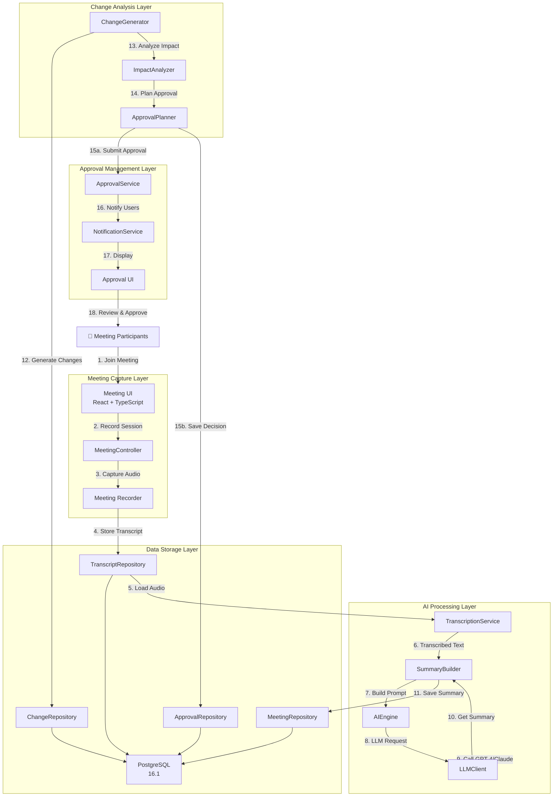
```mermaid
graph TB
    Participant["👥 Meeting Participants"]
    
    subgraph Capture["Meeting Capture Layer"]
        MeetingUI["Meeting UI<br/>React + TypeScript"]
        MeetingController["MeetingController"]
        Recorder["Meeting Recorder"]
    end
    
    subgraph Processing["AI Processing Layer"]
        Transcriber["TranscriptionService"]
        AIEngine["AIEngine"]
        LLMClient["LLMClient"]
        SummaryBuilder["SummaryBuilder"]
    end
    
    subgraph Analysis["Change Analysis Layer"]
        ChangeGenerator["ChangeGenerator"]
        ImpactAnalyzer["ImpactAnalyzer"]
        ApprovalPlanner["ApprovalPlanner"]
    end
    
    subgraph Storage["Data Storage Layer"]
        MeetingRepo["MeetingRepository"]
        TranscriptRepo["TranscriptRepository"]
        ChangeRepo["ChangeRepository"]
        ApprovalRepo["ApprovalRepository"]
        Database["PostgreSQL<br/>16.1"]
    end
    
    subgraph Approval["Approval Management Layer"]
        ApprovalService["ApprovalService"]
        NotificationService["NotificationService"]
        ApprovalUI["Approval UI"]
    end
    
    Participant -->|"1. Join Meeting"| MeetingUI
    MeetingUI -->|"2. Record Session"| MeetingController
    MeetingController -->|"3. Capture Audio"| Recorder
    Recorder -->|"4. Store Transcript"| TranscriptRepo
    TranscriptRepo --> Database
    
    TranscriptRepo -->|"5. Load Audio"| Transcriber
    Transcriber -->|"6. Transcribed Text"| SummaryBuilder
    SummaryBuilder -->|"7. Build Prompt"| AIEngine
    AIEngine -->|"8. LLM Request"| LLMClient
    LLMClient -->|"9. Call GPT-4/Claude"| Processing
    LLMClient -->|"10. Get Summary"| SummaryBuilder
    
    SummaryBuilder -->|"11. Save Summary"| MeetingRepo
    MeetingRepo --> Database
    
    ChangeGenerator -->|"12. Generate Changes"| ChangeRepo
    ChangeRepo --> Database
    
    ChangeGenerator -->|"13. Analyze Impact"| ImpactAnalyzer
    ImpactAnalyzer -->|"14. Plan Approval"| ApprovalPlanner
    ApprovalPlanner -->|"15a. Submit Approval"| ApprovalService
    ApprovalPlanner -->|"15b. Save Decision"| ApprovalRepo
    ApprovalRepo --> Database
    
    ApprovalService -->|"16. Notify Users"| NotificationService
    NotificationService -->|"17. Display"| ApprovalUI
    ApprovalUI -->|"18. Review & Approve"| Participant
```

### dev_spec_2_diagram_2.mmd - Class Diagram (WF1-WF6 with 15 Enums)

Shows meeting workflow classes, AI summary services, approval workflow, change execution, and all 15 enum types.

```mermaid
classDiagram
    %% WF1: Meeting Content Capture
    class MeetingController {
        -startMeeting()
        -endMeeting()
        -recordNote()
    }
    
    class MeetingService {
        -createMeeting()
        -updateMeeting()
        -getMeeting()
    }
    
    class SummaryInputController {
        -submitSummary()
    }
    
    class SummaryInputService {
        -validateSummary()
        -processSummaryInput()
    }

    %% WF2: AI Summary Generation
    class SummaryController {
        -generateSummary()
        -getSummary()
    }
    
    class SummaryService {
        -createSummary()
        -extractActionItems()
    }
    
    class AIEngine {
        -analyzeMeeting()
        -generateSummary()
    }
    
    class PromptBuilder {
        -buildAnalysisPrompt()
    }
    
    class LLMClient {
        -sendRequest()
        -parseResponse()
    }
    
    class ContentStructurer {
        -structure()
        -formatForReview()
    }

    %% WF3: Approval Workflow
    class ApprovalController {
        -createRequest()
        -submitResponse()
    }
    
    class ApprovalService {
        -processApproval()
        -evaluateQuorum()
    }
    
    class ConsensusEngine {
        -calculateConsensus()
        -validateThreshold()
    }
    
    class ReviewController {
        -getChecklist()
        -updateChecklistItem()
    }
    
    class ReviewService {
        -createChecklist()
        -manageChecklist()
    }

    %% WF4: Change Execution
    class ChangeController {
        -executeChange()
    }
    
    class ChangeService {
        -applyChanges()
        -rollback()
    }
    
    class ChangeExecutor {
        -executeIndividualChange()
    }

    %% WF5: Infrastructure & Security
    class AuthController {
        -login()
        -register()
    }
    
    class AuthService {
        -authenticate()
        -authorize()
    }
    
    class PermissionManager {
        -checkPermission()
    }
    
    class JWTUtil {
        -generateToken()
        -validateToken()
    }

    %% Repositories
    class UserRepository {
        -save()
        -findById()
    }
    
    class MeetingRepository {
        -save()
        -findById()
    }
    
    class SummaryRepository {
        -save()
        -findById()
    }
    
    class ApprovalRepository {
        -save()
        -findById()
    }

    %% WF6: Domain Models & Enums
    class User {
        -id: UUID
        -email: String
        -role: Role
    }
    
    class SessionStatus {
        <<enumeration>>
        SCHEDULED
        IN_PROGRESS
        COMPLETE
        CANCELLED
    }
    
    class NoteType {
        <<enumeration>>
        ACTION
        DECISION
        CHANGE
        GENERAL
    }
    
    class SummaryStatus {
        <<enumeration>>
        PENDING
        APPROVED
        REJECTED
    }
    
    class Priority {
        <<enumeration>>
        LOW
        MEDIUM
        HIGH
        CRITICAL
    }
    
    class ActionStatus {
        <<enumeration>>
        PENDING
        IN_PROGRESS
        COMPLETE
    }
    
    class ChangeType {
        <<enumeration>>
        WORKFLOW
        PROCESS
        CONFIGURATION
        DATA
    }
    
    class ImpactLevel {
        <<enumeration>>
        LOW
        MEDIUM
        HIGH
        CRITICAL
    }
    
    class ApprovalStatus {
        <<enumeration>>
        PENDING
        IN_REVIEW
        APPROVED
        REJECTED
    }
    
    class ChecklistStatus {
        <<enumeration>>
        PENDING
        IN_REVIEW
        COMPLETE
    }
    
    class ExecutionStatus {
        <<enumeration>>
        PENDING
        EXECUTING
        COMPLETED
        ROLLED_BACK
    }
    
    class SectionType {
        <<enumeration>>
        ACTION_ITEMS
        DECISIONS
        CHANGES
    }
    
    class EntityType {
        <<enumeration>>
        PROJECT
        BOARD
        CARD
        MEETING
    }
    
    class Permission
    class Role

    %% Relationships
    MeetingController --> MeetingService
    SummaryInputController --> SummaryInputService
    SummaryController --> SummaryService
    SummaryService --> AIEngine
    AIEngine --> LLMClient
    SummaryService --> ContentStructurer
    ApprovalController --> ApprovalService
    ReviewController --> ReviewService
    ChangeController --> ChangeService
    AuthController --> AuthService
    AuthService --> JWTUtil

    MeetingService --> MeetingRepository
    SummaryService --> SummaryRepository
    ApprovalService --> ApprovalRepository
    AuthService --> UserRepository
    
    User --> Role
    Role --> Permission
    MeetingService --> SessionStatus
    ContentStructurer --> ActionStatus
    ContentStructurer --> ChangeType
```

### dev_spec_2_diagram_3.mmd - Meeting Session State Diagram

Shows the complete lifecycle of a meeting from scheduling through completion.

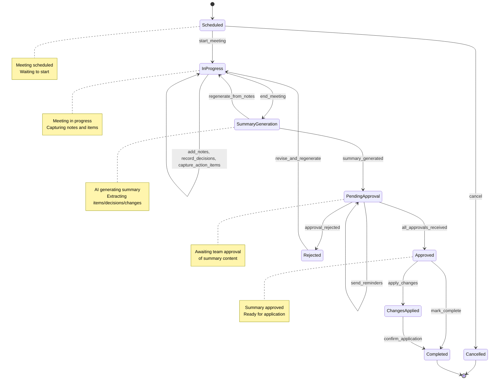
```mermaid
stateDiagram-v2
    [*] --> Scheduled
    
    Scheduled --> InProgress: start_meeting
    Scheduled --> Cancelled: cancel
    
    InProgress --> SummaryGeneration: end_meeting
    InProgress --> InProgress: add_notes, record_decisions, capture_action_items
    
    SummaryGeneration --> PendingApproval: summary_generated
    SummaryGeneration --> InProgress: regenerate_from_notes
    
    PendingApproval --> Approved: all_approvals_received
    PendingApproval --> Rejected: approval_rejected
    PendingApproval --> PendingApproval: send_reminders
    
    Approved --> ChangesApplied: apply_changes
    Approved --> Completed: mark_complete
    
    Rejected --> InProgress: revise_and_regenerate
    
    ChangesApplied --> Completed: confirm_application
    
    Cancelled --> [*]
    Completed --> [*]
    
    note right of Scheduled
        Meeting scheduled
        Waiting to start
    end note
    
    note right of InProgress
        Meeting in progress
        Capturing notes and items
    end note
    
    note right of SummaryGeneration
        AI generating summary
        Extracting items/decisions/changes
    end note
    
    note right of PendingApproval
        Awaiting team approval
        of summary content
    end note
    
    note right of Approved
        Summary approved
        Ready for application
    end note
```

### dev_spec_2_diagram_4.mmd - Approval Request State Diagram

State transitions for approval requests during meeting summary and change approval workflow.

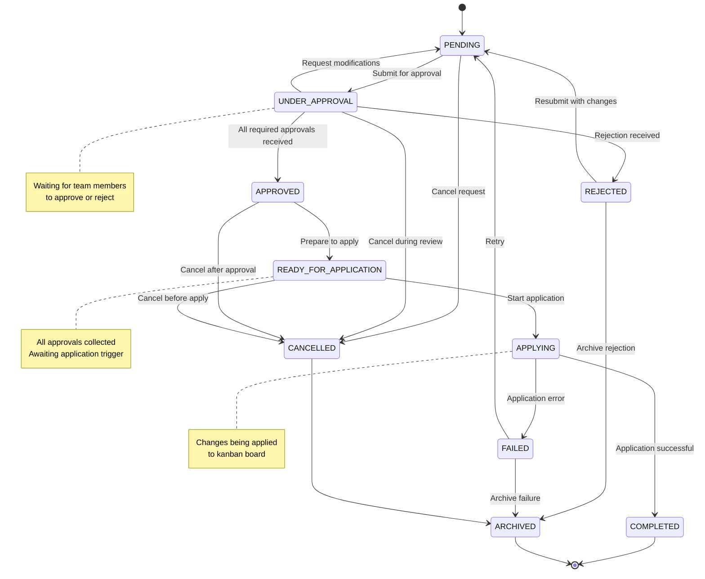
```mermaid
stateDiagram-v2
    [*] --> PENDING
    
    PENDING --> UNDER_APPROVAL: Submit for approval
    PENDING --> CANCELLED: Cancel request
    
    UNDER_APPROVAL --> APPROVED: All required approvals received
    UNDER_APPROVAL --> REJECTED: Rejection received
    UNDER_APPROVAL --> PENDING: Request modifications
    UNDER_APPROVAL --> CANCELLED: Cancel during review
    
    APPROVED --> READY_FOR_APPLICATION: Prepare to apply
    APPROVED --> CANCELLED: Cancel after approval
    
    REJECTED --> PENDING: Resubmit with changes
    REJECTED --> ARCHIVED: Archive rejection
    
    READY_FOR_APPLICATION --> APPLYING: Start application
    READY_FOR_APPLICATION --> CANCELLED: Cancel before apply
    
    APPLYING --> COMPLETED: Application successful
    APPLYING --> FAILED: Application error
    
    COMPLETED --> [*]
    FAILED --> PENDING: Retry
    FAILED --> ARCHIVED: Archive failure
    
    CANCELLED --> ARCHIVED
    ARCHIVED --> [*]
    
    note right of UNDER_APPROVAL
        Waiting for team members
        to approve or reject
    end note
    
    note right of READY_FOR_APPLICATION
        All approvals collected
        Awaiting application trigger
    end note
    
    note right of APPLYING
        Changes being applied
        to kanban board
    end note
```

### dev_spec_2_diagram_5.mmd - Change Execution State Diagram

State transitions for change execution during the approval and application process.

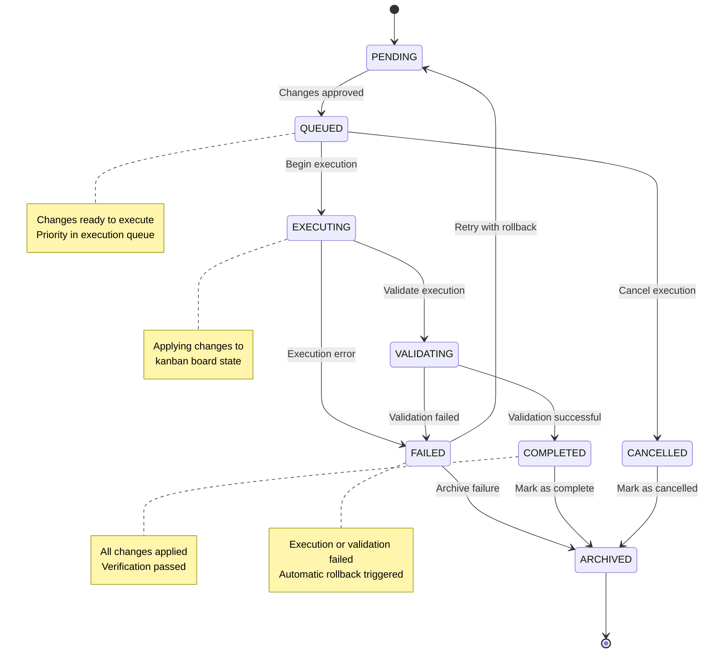
```mermaid
stateDiagram-v2
    [*] --> PENDING
    
    PENDING --> QUEUED: Changes approved
    QUEUED --> EXECUTING: Begin execution
    QUEUED --> CANCELLED: Cancel execution
    
    EXECUTING --> VALIDATING: Validate execution
    EXECUTING --> FAILED: Execution error
    
    VALIDATING --> COMPLETED: Validation successful
    VALIDATING --> FAILED: Validation failed
    
    FAILED --> PENDING: Retry with rollback
    FAILED --> ARCHIVED: Archive failure
    
    COMPLETED --> ARCHIVED: Mark as complete
    CANCELLED --> ARCHIVED: Mark as cancelled
    
    ARCHIVED --> [*]
    
    note right of QUEUED
        Changes ready to execute
        Priority in execution queue
    end note
    
    note right of EXECUTING
        Applying changes to
        kanban board state
    end note
    
    note right of COMPLETED
        All changes applied
        Verification passed
    end note
    
    note right of FAILED
        Execution or validation failed
        Automatic rollback triggered
    end note
```

### dev_spec_2_diagram_6.mmd - Meeting Summary Generation Flow (Sequence Diagram)

Detailed sequence showing how a meeting summary is captured, generated via AI, and sent for approval.

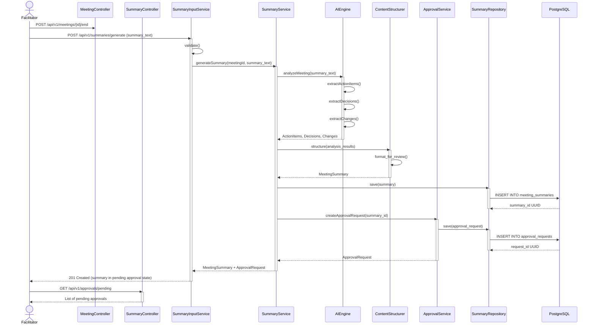
```mermaid
sequenceDiagram
    actor Facilitator
    participant MeetingCtrl as MeetingController
    participant SummaryCtrl as SummaryController
    participant SummaryInput as SummaryInputService
    participant SummaryService
    participant AIEngine
    participant ContentStructurer
    participant ApprovalService
    participant Repo as SummaryRepository
    participant DB as PostgreSQL

    Facilitator->>MeetingCtrl: POST /api/v1/meetings/{id}/end
    activate MeetingCtrl
    
    Facilitator->>SummaryInput: POST /api/v1/summaries/generate (summary_text)
    activate SummaryInput
    SummaryInput->>SummaryInput: validate()
    
    SummaryInput->>SummaryService: generateSummary(meetingId, summary_text)
    activate SummaryService
    
    SummaryService->>AIEngine: analyzeMeeting(summary_text)
    activate AIEngine
    AIEngine->>AIEngine: extractActionItems()
    AIEngine->>AIEngine: extractDecisions()
    AIEngine->>AIEngine: extractChanges()
    AIEngine-->>SummaryService: ActionItems, Decisions, Changes
    deactivate AIEngine
    
    SummaryService->>ContentStructurer: structure(analysis_results)
    activate ContentStructurer
    ContentStructurer->>ContentStructurer: format_for_review()
    ContentStructurer-->>SummaryService: MeetingSummary
    deactivate ContentStructurer
    
    SummaryService->>Repo: save(summary)
    activate Repo
    Repo->>DB: INSERT INTO meeting_summaries
    DB-->>Repo: summary_id UUID
    deactivate Repo
    
    SummaryService->>ApprovalService: createApprovalRequest(summary_id)
    activate ApprovalService
    ApprovalService->>Repo: save(approval_request)
    activate Repo
    Repo->>DB: INSERT INTO approval_requests
    DB-->>Repo: request_id UUID
    deactivate Repo
    ApprovalService-->>SummaryService: ApprovalRequest
    deactivate ApprovalService
    
    SummaryService-->>SummaryInput: MeetingSummary + ApprovalRequest
    deactivate SummaryService
    
    SummaryInput-->>Facilitator: 201 Created (summary in pending approval state)
    deactivate SummaryInput
    
    Facilitator->>SummaryCtrl: GET /api/v1/approvals/pending
    activate SummaryCtrl
    SummaryCtrl-->>Facilitator: List of pending approvals
    deactivate SummaryCtrl
```

---

## Dev Spec 3: Change Review & Approval - Change Application

### dev_spec_3_diagram_1.mmd - Architecture Diagram (AP1-AP6 System)

System architecture for change review and approval workflow with six modules.

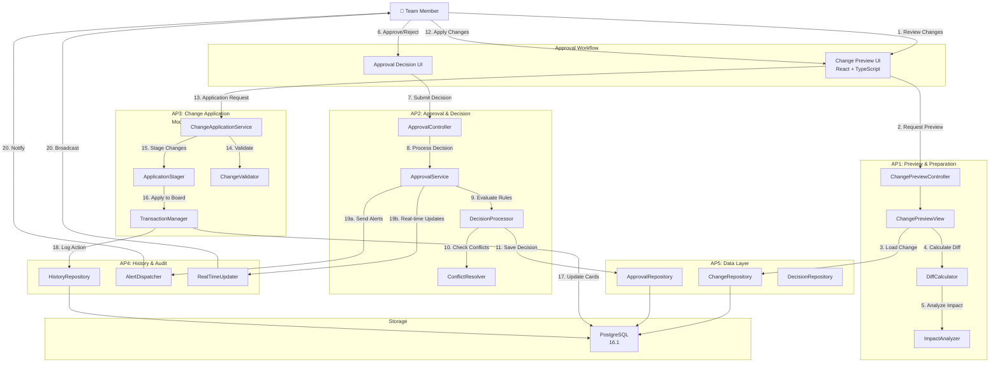
```mermaid
graph TB
    User["👤 Team Member"]
    
    subgraph Approval["Approval Workflow"]
        PreviewUI["Change Preview UI<br/>React + TypeScript"]
        ApprovalUI["Approval Decision UI"]
    end
    
    subgraph AP1["AP1: Preview & Preparation<br/>Module"]
        ChangePreviewCtrl["ChangePreviewController"]
        ChangePreviewView["ChangePreviewView"]
        DiffCalculator["DiffCalculator"]
        ImpactAnalyzer["ImpactAnalyzer"]
    end
    
    subgraph AP2["AP2: Approval & Decision<br/>Module"]
        ApprovalCtrl["ApprovalController"]
        ApprovalService["ApprovalService"]
        DecisionProcessor["DecisionProcessor"]
        ConflictResolver["ConflictResolver"]
    end
    
    subgraph AP3["AP3: Change Application<br/>Module"]
        ChangeAppService["ChangeApplicationService"]
        ApplicationStager["ApplicationStager"]
        TransactionManager["TransactionManager"]
        ChangeValidator["ChangeValidator"]
    end
    
    subgraph AP4["AP4: History & Audit<br/>Module"]
        HistoryRepo["HistoryRepository"]
        AlertDispatcher["AlertDispatcher"]
        RealTimeUpdater["RealTimeUpdater"]
    end
    
    subgraph AP5["AP5: Data Layer<br/>Module"]
        ChangeRepo["ChangeRepository"]
        ApprovalRepo["ApprovalRepository"]
        DecisionRepo["DecisionRepository"]
    end
    
    subgraph Storage["Storage"]
        Database["PostgreSQL<br/>16.1"]
    end
    
    User -->|"1. Review Changes"| PreviewUI
    PreviewUI -->|"2. Request Preview"| ChangePreviewCtrl
    ChangePreviewCtrl --> ChangePreviewView
    
    ChangePreviewView -->|"3. Load Change"| ChangeRepo
    ChangeRepo --> Database
    
    ChangePreviewView -->|"4. Calculate Diff"| DiffCalculator
    DiffCalculator -->|"5. Analyze Impact"| ImpactAnalyzer
    
    User -->|"6. Approve/Reject"| ApprovalUI
    ApprovalUI -->|"7. Submit Decision"| ApprovalCtrl
    ApprovalCtrl -->|"8. Process Decision"| ApprovalService
    ApprovalService -->|"9. Evaluate Rules"| DecisionProcessor
    DecisionProcessor -->|"10. Check Conflicts"| ConflictResolver
    
    DecisionProcessor -->|"11. Save Decision"| ApprovalRepo
    ApprovalRepo --> Database
    
    User -->|"12. Apply Changes"| PreviewUI
    PreviewUI -->|"13. Application Request"| ChangeAppService
    
    ChangeAppService -->|"14. Validate"| ChangeValidator
    ChangeAppService -->|"15. Stage Changes"| ApplicationStager
    ApplicationStager -->|"16. Apply to Board"| TransactionManager
    TransactionManager -->|"17. Update Cards"| Database
    
    TransactionManager -->|"18. Log Action"| HistoryRepo
    HistoryRepo --> Database
    
    ApprovalService -->|"19a. Send Alerts"| AlertDispatcher
    ApprovalService -->|"19b. Real-time Updates"| RealTimeUpdater
    AlertDispatcher -->|"20. Notify"| User
    RealTimeUpdater -->|"20. Broadcast"| User
```

### dev_spec_3_diagram_2.mmd - Core Classes and Relationships (AP1-AP6)

Shows all change review and approval classes organized by module (AP1-AP6).

```mermaid
classDiagram
    %% AP1: Preview & Preparation
    class ChangePreviewView {
        <<UI>>
        -renderChanges()
        -displayDiff()
    }
    
    class ChangePreviewController {
        -getPreviewChanges()
        -getChangeDetail()
        -getDiff()
    }
    
    class DiffViewer {
        <<UI>>
        -renderDiff()
    }
    
    class DiffCalculator {
        -calculateDiff()
    }
    
    class ImpactViewer {
        <<UI>>
        -displayImpact()
    }
    
    class ImpactAnalyzer {
        -analyzeImpact()
    }
    
    class ChangePreviewService {
        -loadPendingChanges()
        -getChangePreview()
    }

    %% AP2: Approval & Decision
    class ApprovalComponent {
        <<UI>>
        -renderApprovalButtons()
    }
    
    class ApprovalController {
        -approveChange()
        -rejectChange()
        -approveBatch()
    }
    
    class ApprovalService {
        -submitApproval()
        -submitRejection()
    }
    
    class DecisionProcessor {
        -processDecision()
        -evaluateQuorum()
    }
    
    class ConflictResolver {
        -detectConflicts()
        -resolveConflicts()
    }
    
    class ApprovalRuleEngine {
        -evaluateRules()
    }

    %% AP3: Change Application
    class ApplicationStager {
        -prepareApplication()
    }
    
    class TransactionManager {
        -beginTransaction()
        -commit()
        -rollback()
    }
    
    class ChangeApplicationService {
        -applyApprovedChanges()
        -verifyApplication()
        -rollbackChange()
    }
    
    class ChangeValidator {
        -validateApplication()
    }
    
    class ConsistencyChecker {
        -verifyIntegrity()
    }

    %% AP4: History & Audit
    class AuditLogger {
        <<Utility>>
        -recordAction()
    }
    
    class HistoryRepository {
        -saveHistory()
        -getHistory()
    }
    
    class AlertDispatcher {
        -sendAlert()
    }

    %% AP5: Data Layer
    class ChangeRepository {
        -save()
        -findById()
    }
    
    class ApprovalRepository {
        -save()
        -findById()
    }
    
    class AuditRepository {
        -save()
        -findById()
    }

    %% AP6: External Integration
    class KanbanBoardGateway {
        -fetchBoardState()
        -applyChanges()
    }
    
    class MeetingGateway {
        -fetchChanges()
    }

    %% Domain Models
    class PreviewChange {
        -id: UUID
        -changeId: UUID
        -changeType: ChangeType
        -currentState: Map
        -proposedState: Map
        -status: PreviewStatus
    }
    
    class ApprovalDecision {
        -id: UUID
        -changeId: UUID
        -approverId: UUID
        -decision: Decision
        -feedback: String
    }
    
    class ChangeSnapshot {
        -id: UUID
        -changeId: UUID
        -boardStateBefore: Map
        -boardStateAfter: Map
    }
    
    class AuditEntry {
        -id: UUID
        -changeId: UUID
        -action: String
        -actor: UUID
        -timestamp: DateTime
    }

    %% Enums
    class ChangeType {
        <<enumeration>>
        MOVE_CARD
        UPDATE_CARD
        CREATE_CARD
        DELETE_CARD
    }
    
    class PreviewStatus {
        <<enumeration>>
        PENDING
        UNDER_REVIEW
        APPROVED
        REJECTED
        READY_FOR_APPLICATION
        APPLYING
        APPLIED
        ROLLED_BACK
    }
    
    class ImpactLevel {
        <<enumeration>>
        LOW
        MEDIUM
        HIGH
        CRITICAL
    }
    
    class Decision {
        <<enumeration>>
        APPROVE
        REJECT
        DEFER
    }

    %% Relationships
    ChangePreviewController --> ChangePreviewService
    ChangePreviewView --> DiffViewer
    ChangePreviewService --> DiffCalculator
    ChangePreviewService --> ImpactAnalyzer
    
    ApprovalController --> ApprovalService
    ApprovalComponent --> ApprovalController
    ApprovalService --> DecisionProcessor
    DecisionProcessor --> ApprovalRuleEngine
    ApprovalService --> ConflictResolver
    
    ChangeApplicationService --> ApplicationStager
    ChangeApplicationService --> TransactionManager
    ChangeApplicationService --> ChangeValidator
    ChangeValidator --> ConsistencyChecker
    ChangeApplicationService --> KanbanBoardGateway
    
    ChangePreviewService --> ChangeRepository
    ApprovalService --> ApprovalRepository
    AuditLogger --> AuditRepository
    
    PreviewChange --> ChangeType
    PreviewChange --> PreviewStatus
    ApprovalDecision --> Decision
```

### dev_spec_3_diagram_3.mmd - PreviewChange State Diagram

Shows the complete lifecycle of a change from pending through application or rollback.

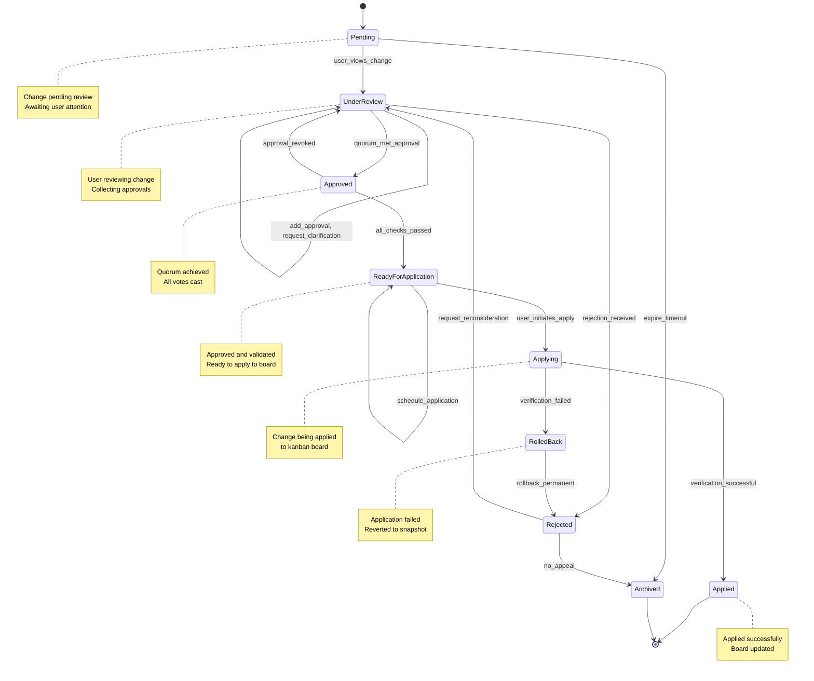
```mermaid
stateDiagram-v2
    [*] --> Pending
    
    Pending --> UnderReview: user_views_change
    Pending --> Archived: expire_timeout
    
    UnderReview --> Approved: quorum_met_approval
    UnderReview --> Rejected: rejection_received
    UnderReview --> UnderReview: add_approval, request_clarification
    
    Approved --> ReadyForApplication: all_checks_passed
    Approved --> UnderReview: approval_revoked
    
    Rejected --> Archived: no_appeal
    Rejected --> UnderReview: request_reconsideration
    
    ReadyForApplication --> Applying: user_initiates_apply
    ReadyForApplication --> ReadyForApplication: schedule_application
    
    Applying --> Applied: verification_successful
    Applying --> RolledBack: verification_failed
    
    Applied --> [*]
    RolledBack --> Rejected: rollback_permanent
    
    Archived --> [*]
    
    note right of Pending
        Change pending review
        Awaiting user attention
    end note
    
    note right of UnderReview
        User reviewing change
        Collecting approvals
    end note
    
    note right of Approved
        Quorum achieved
        All votes cast
    end note
    
    note right of ReadyForApplication
        Approved and validated
        Ready to apply to board
    end note
    
    note right of Applying
        Change being applied
        to kanban board
    end note
    
    note right of Applied
        Applied successfully
        Board updated
    end note
    
    note right of RolledBack
        Application failed
        Reverted to snapshot
    end note
```

### dev_spec_3_diagram_4.mmd - Approval Decision Workflow State Diagram

Complete state machine for change approval decisions and application workflow.

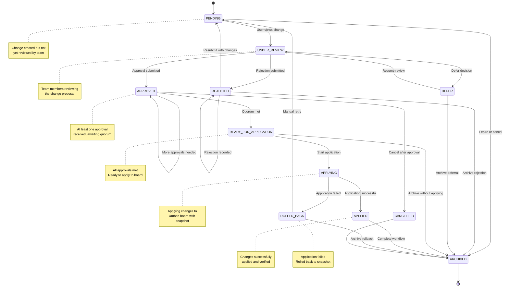
```mermaid
stateDiagram-v2
    [*] --> PENDING
    
    PENDING --> UNDER_REVIEW: User views change
    PENDING --> ARCHIVED: Expire or cancel
    
    UNDER_REVIEW --> APPROVED: Approval submitted
    UNDER_REVIEW --> REJECTED: Rejection submitted
    UNDER_REVIEW --> DEFER: Defer decision
    
    APPROVED --> APPROVED: More approvals needed
    APPROVED --> READY_FOR_APPLICATION: Quorum met
    APPROVED --> CANCELLED: Cancel after approval
    
    REJECTED --> REJECTED: Rejection recorded
    REJECTED --> PENDING: Resubmit with changes
    REJECTED --> ARCHIVED: Archive rejection
    
    DEFER --> UNDER_REVIEW: Resume review
    DEFER --> ARCHIVED: Archive deferral
    
    READY_FOR_APPLICATION --> APPLYING: Start application
    READY_FOR_APPLICATION --> ARCHIVED: Archive without applying
    
    APPLYING --> APPLIED: Application successful
    APPLYING --> ROLLED_BACK: Application failed
    
    APPLIED --> ARCHIVED: Complete workflow
    ROLLED_BACK --> PENDING: Manual retry
    ROLLED_BACK --> ARCHIVED: Archive rollback
    
    CANCELLED --> ARCHIVED
    ARCHIVED --> [*]
    
    note right of PENDING
        Change created but not
        yet reviewed by team
    end note
    
    note right of UNDER_REVIEW
        Team members reviewing
        the change proposal
    end note
    
    note right of APPROVED
        At least one approval
        received, awaiting quorum
    end note
    
    note right of READY_FOR_APPLICATION
        All approvals met
        Ready to apply to board
    end note
    
    note right of APPLYING
        Applying changes to
        kanban board with snapshot
    end note
    
    note right of APPLIED
        Changes successfully
        applied and verified
    end note
    
    note right of ROLLED_BACK
        Application failed
        Rolled back to snapshot
    end note
```

### dev_spec_3_diagram_5-9.mmd - Five Flow Scenarios (Sequence Diagrams)

Complete sequence diagrams for all five user scenarios in change review and approval.

#### Scenario 1: Load and Display Change Preview

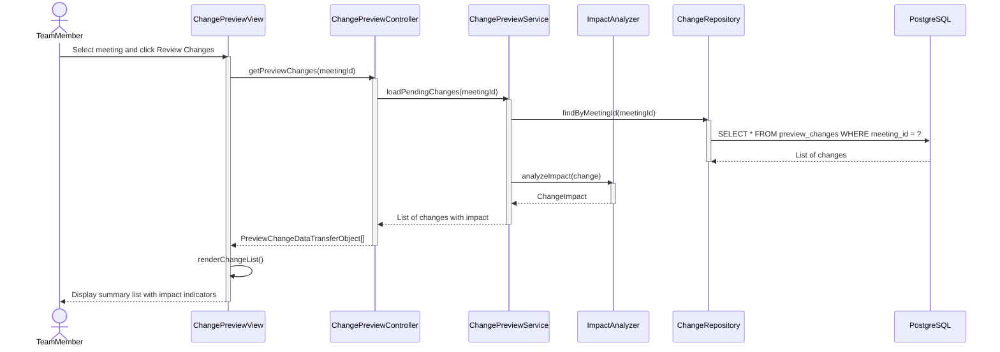
```mermaid
sequenceDiagram
    actor User as TeamMember
    participant View as ChangePreviewView
    participant Ctrl as ChangePreviewController
    participant Service as ChangePreviewService
    participant Analyzer as ImpactAnalyzer
    participant Repo as ChangeRepository
    participant DB as PostgreSQL

    User->>View: Select meeting and click Review Changes
    activate View
    
    View->>Ctrl: getPreviewChanges(meetingId)
    activate Ctrl
    
    Ctrl->>Service: loadPendingChanges(meetingId)
    activate Service
    
    Service->>Repo: findByMeetingId(meetingId)
    activate Repo
    Repo->>DB: SELECT * FROM preview_changes WHERE meeting_id = ?
    DB-->>Repo: List of changes
    deactivate Repo
    
    Service->>Analyzer: analyzeImpact(change)
    activate Analyzer
    Analyzer-->>Service: ChangeImpact
    deactivate Analyzer
    
    Service-->>Ctrl: List of changes with impact
    deactivate Service
    
    Ctrl-->>View: PreviewChangeDataTransferObject[]
    deactivate Ctrl
    
    View->>View: renderChangeList()
    View-->>User: Display summary list with impact indicators
    deactivate View
```

#### Scenario 2: Review Change with Diff

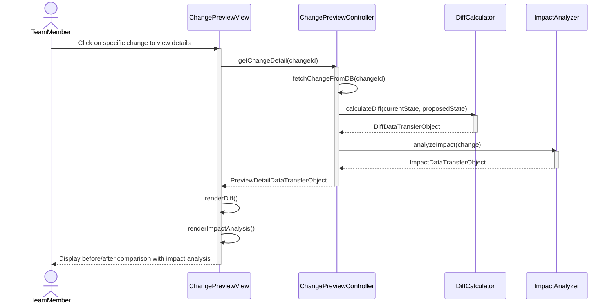
```mermaid
sequenceDiagram
    actor User as TeamMember
    participant View as ChangePreviewView
    participant Ctrl as ChangePreviewController
    participant DiffCalc as DiffCalculator
    participant Analyzer as ImpactAnalyzer

    User->>View: Click on specific change to view details
    activate View
    
    View->>Ctrl: getChangeDetail(changeId)
    activate Ctrl
    
    Ctrl->>Ctrl: fetchChangeFromDB(changeId)
    
    Ctrl->>DiffCalc: calculateDiff(currentState, proposedState)
    activate DiffCalc
    DiffCalc-->>Ctrl: DiffDataTransferObject
    deactivate DiffCalc
    
    Ctrl->>Analyzer: analyzeImpact(change)
    activate Analyzer
    Analyzer-->>Ctrl: ImpactDataTransferObject
    deactivate Analyzer
    
    Ctrl-->>View: PreviewDetailDataTransferObject
    deactivate Ctrl
    
    View->>View: renderDiff()
    View->>View: renderImpactAnalysis()
    View-->>User: Display before/after comparison with impact analysis
    deactivate View
```

#### Scenario 3: Approve Single Change

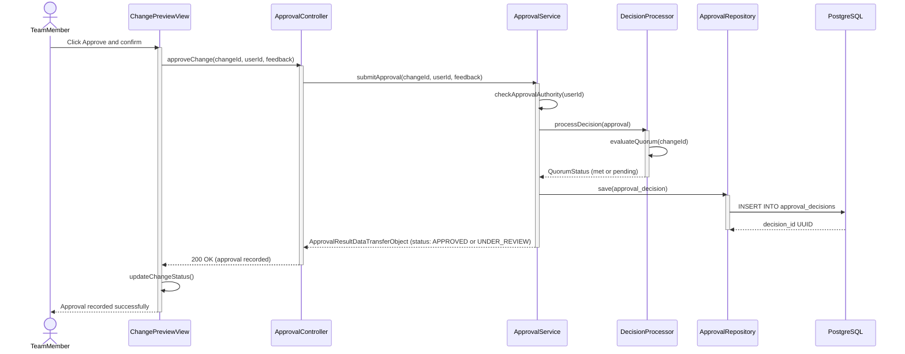
```mermaid
sequenceDiagram
    actor User as TeamMember
    participant View as ChangePreviewView
    participant Ctrl as ApprovalController
    participant Service as ApprovalService
    participant Processor as DecisionProcessor
    participant Repo as ApprovalRepository
    participant DB as PostgreSQL

    User->>View: Click Approve and confirm
    activate View
    
    View->>Ctrl: approveChange(changeId, userId, feedback)
    activate Ctrl
    
    Ctrl->>Service: submitApproval(changeId, userId, feedback)
    activate Service
    
    Service->>Service: checkApprovalAuthority(userId)
    
    Service->>Processor: processDecision(approval)
    activate Processor
    Processor->>Processor: evaluateQuorum(changeId)
    
    Processor-->>Service: QuorumStatus (met or pending)
    deactivate Processor
    
    Service->>Repo: save(approval_decision)
    activate Repo
    Repo->>DB: INSERT INTO approval_decisions
    DB-->>Repo: decision_id UUID
    deactivate Repo
    
    Service-->>Ctrl: ApprovalResultDataTransferObject (status: APPROVED or UNDER_REVIEW)
    deactivate Service
    
    Ctrl-->>View: 200 OK (approval recorded)
    deactivate Ctrl
    
    View->>View: updateChangeStatus()
    View-->>User: Approval recorded successfully
    deactivate View
```

#### Scenario 4: Apply Approved Changes

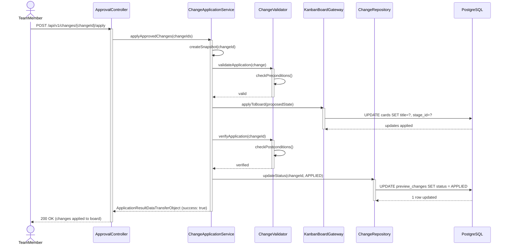
```mermaid
sequenceDiagram
    actor User as TeamMember
    participant Ctrl as ApprovalController
    participant AppService as ChangeApplicationService
    participant Validator as ChangeValidator
    participant Gateway as KanbanBoardGateway
    participant Repo as ChangeRepository
    participant DB as PostgreSQL

    User->>Ctrl: POST /api/v1/changes/{changeId}/apply
    activate Ctrl
    
    Ctrl->>AppService: applyApprovedChanges(changeIds)
    activate AppService
    
    AppService->>AppService: createSnapshot(changeId)
    
    AppService->>Validator: validateApplication(change)
    activate Validator
    Validator->>Validator: checkPreconditions()
    Validator-->>AppService: valid
    deactivate Validator
    
    AppService->>Gateway: applyToBoard(proposedState)
    activate Gateway
    Gateway->>DB: UPDATE cards SET title=?, stage_id=?
    DB-->>Gateway: updates applied
    deactivate Gateway
    
    AppService->>Validator: verifyApplication(changeId)
    activate Validator
    Validator->>Validator: checkPostconditions()
    Validator-->>AppService: verified
    deactivate Validator
    
    AppService->>Repo: updateStatus(changeId, APPLIED)
    activate Repo
    Repo->>DB: UPDATE preview_changes SET status = APPLIED
    DB-->>Repo: 1 row updated
    deactivate Repo
    
    AppService-->>Ctrl: ApplicationResultDataTransferObject (success: true)
    deactivate AppService
    
    Ctrl-->>User: 200 OK (changes applied to board)
    deactivate Ctrl
```

#### Scenario 5: Reject Change with Feedback

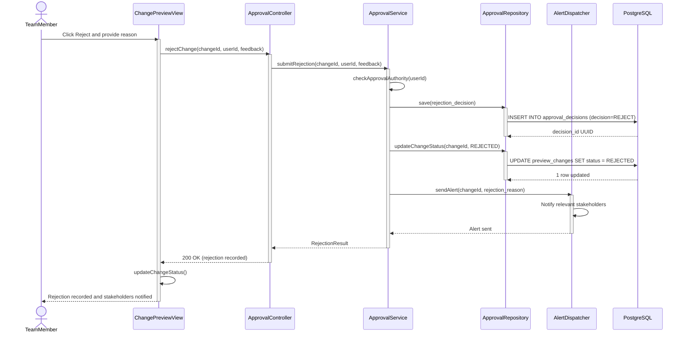
```mermaid
sequenceDiagram
    actor User as TeamMember
    participant View as ChangePreviewView
    participant Ctrl as ApprovalController
    participant Service as ApprovalService
    participant Repo as ApprovalRepository
    participant Dispatcher as AlertDispatcher
    participant DB as PostgreSQL

    User->>View: Click Reject and provide reason
    activate View
    
    View->>Ctrl: rejectChange(changeId, userId, feedback)
    activate Ctrl
    
    Ctrl->>Service: submitRejection(changeId, userId, feedback)
    activate Service
    
    Service->>Service: checkApprovalAuthority(userId)
    
    Service->>Repo: save(rejection_decision)
    activate Repo
    Repo->>DB: INSERT INTO approval_decisions (decision=REJECT)
    DB-->>Repo: decision_id UUID
    deactivate Repo
    
    Service->>Repo: updateChangeStatus(changeId, REJECTED)
    activate Repo
    Repo->>DB: UPDATE preview_changes SET status = REJECTED
    DB-->>Repo: 1 row updated
    deactivate Repo
    
    Service->>Dispatcher: sendAlert(changeId, rejection_reason)
    activate Dispatcher
    Dispatcher->>Dispatcher: Notify relevant stakeholders
    Dispatcher-->>Service: Alert sent
    deactivate Dispatcher
    
    Service-->>Ctrl: RejectionResult
    deactivate Service
    
    Ctrl-->>View: 200 OK (rejection recorded)
    deactivate Ctrl
    
    View->>View: updateChangeStatus()
    View-->>User: Rejection recorded and stakeholders notified
    deactivate View
```

---

## Summary of Updates

| Class Name (OLD) | Class Name (NEW) | Status |
|------------------|-----------------|--------|
| ArtificialIntelligenceEngine | AIEngine | ✅ Updated in all diagrams |
| LargeLanguageModelClient | LLMClient | ✅ Updated in all diagrams |
| JsonWebTokenUtil | JWTUtil | ✅ Updated in all diagrams |
| UniversallyUniqueIdentifier | UUID | ✅ Updated in all diagrams |

All diagrams now use:
- **Tech Stack:** Java 21 LTS, Spring Boot 3.2.0, PostgreSQL 16.1, React 18.2.0, TypeScript 5.3.2
- **AI Services:** OpenAI GPT-4, LangChain4j 0.24.0
- **API Base:** `/api/v1/` (consistent across all three specs)
- **Authentication:** JWT-based with Spring Security
- **Database:** PostgreSQL with Spring Data JPA and Flyway migrations

**Export Instructions:**
1. Copy each code block above
2. Paste into [Mermaid Live Editor](https://mermaid.live/)
3. Export as PNG and save to `/docs/images/`
4. Name files as: `dev_spec1_diagram_2.png`, `dev_spec_2_diagram_2.png`, etc.
5. Replace existing PNG files in the repository

